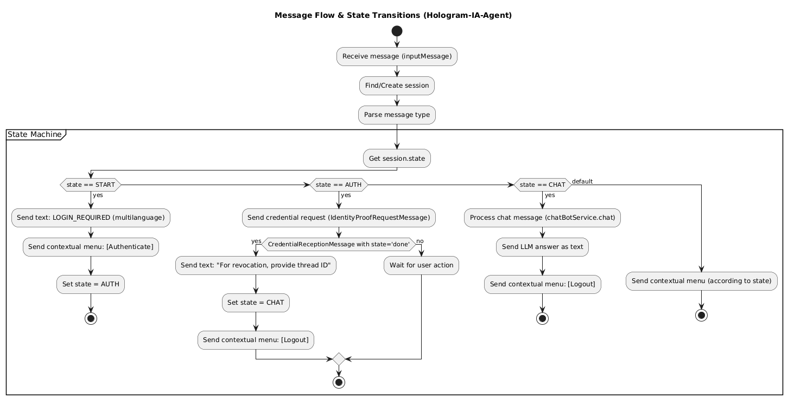

# 🤖 hologram-generic-ai-agent-vs

A modular, multi-language AI agent built with NestJS for the Hologram + Verana ecosystem. Supports LLM integration (OpenAI, Ollama, Anthropic), RAG, MCP (Model Context Protocol) servers, verifiable credential authentication, and per-user tool configuration — all driven by a single `agent-pack.yaml` manifest.

---

## 🚀 Overview

- **Personalized AI welcome** — sends a greeting message when a user connects via Hologram
- **Multi-LLM support** — OpenAI, Ollama, Anthropic with configurable model, temperature, and tokens
- **RAG** — Retrieval Augmented Generation with Pinecone or Redis vector stores
- **MCP integration** — connect to remote MCP servers (e.g. GitHub Copilot MCP) and expose their tools to the LLM agent
- **Per-user MCP credentials** — users configure their own tokens via an in-chat flow; stored with AES-256-GCM encryption
- **Lazy tool discovery** — MCP servers that require user tokens connect on-demand, not at startup
- **Verifiable credential authentication** — DIDComm-based auth with contextual menus
- **Session memory** — in-memory or Redis-backed conversation context
- **Multi-language** — English, Spanish, French, Portuguese out-of-the-box
- **Agent Packs** — all configuration in one `agent-pack.yaml` manifest with `${ENV_VAR}` placeholders
- **Helm chart** — production-ready Kubernetes deployment

---

## 🗂️ Project Structure

```text
src/
  ├── core/           # CoreService (message routing, state machine, menus, auth, MCP config flow)
  ├── chatbot/        # Chatbot service, prompt logic, session handling
  ├── llm/            # LLM provider adapters (OpenAI, Ollama, Anthropic) + LangChain agent
  ├── mcp/            # MCP client (connections, lazy discovery, per-user config, tool cache)
  ├── rag/            # RAG services (vector store, document ingestion, context retrieval)
  ├── memory/         # Memory service (in-memory / Redis backends)
  ├── config/         # Agent-pack loader + Zod schema validation
  ├── integrations/   # VS Agent, stats, PostgreSQL integrations
  ├── common/         # Utilities, language detection
  └── main.ts         # Application bootstrap

scripts/
  ├── common.sh       # Shared shell helpers (logging, network config, credential helpers)
  ├── setup.sh        # Full local setup: VS Agent + ngrok + veranad + credentials
  └── start.sh        # Start chatbot in dev mode (hot-reload)

docker/
  └── docker-compose.yml   # Infrastructure services (VS Agent, Redis, PostgreSQL)

agent-packs/
  ├── hologram-welcome/    # Default welcome agent pack
  └── github-agent/        # GitHub MCP agent pack (example)

charts/                    # Helm chart for Kubernetes deployment
```

---

## 💻 Local Development Setup

### Prerequisites

- **Node.js 22+** and **pnpm** (corepack)
- **Docker** (for infrastructure services)
- **ngrok** (authenticated, for VS Agent public URL tunneling)

### Step 1: Clone and install

```bash
git clone git@github.com:2060-io/hologram-generic-ai-agent-vs.git
cd hologram-generic-ai-agent-vs
corepack enable
pnpm install
```

### Step 2: Create `.env`

Copy and adapt the example below:

```env
# App
APP_PORT=3010
LOG_LEVEL=3

# LLM
LLM_PROVIDER=openai
OPENAI_API_KEY=sk-proj-xxx
OPENAI_MODEL=gpt-4o-mini

# Agent Pack (choose one)
AGENT_PACK_PATH=./agent-packs/github-agent
# AGENT_PACK_PATH=./agent-packs/hologram-welcome

# Infrastructure
REDIS_URL=redis://localhost:6379
POSTGRES_HOST=localhost
POSTGRES_USER=hologram
POSTGRES_PASSWORD=hologram
POSTGRES_DB_NAME=hologram-agent

# RAG
VECTOR_STORE=redis
RAG_PROVIDER=langchain
RAG_DOCS_PATH=./docs

# Memory
AGENT_MEMORY_BACKEND=memory
AGENT_MEMORY_WINDOW=8

# VS Agent ports (used by docker-compose and scripts)
VS_AGENT_ADMIN_PORT=3002
VS_AGENT_PUBLIC_PORT=3003

# Auth (optional — omit to hide the Authenticate menu)
# CREDENTIAL_DEFINITION_ID=did:webvh:...

# MCP — GitHub remote MCP server (optional)
GITHUB_MCP_URL=https://api.githubcopilot.com/mcp/
# GITHUB_PERSONAL_ACCESS_TOKEN=github_pat_xxx   # optional admin token
MCP_CONFIG_ENCRYPTION_KEY=<64-char-hex-string>   # required for per-user MCP config

# Stats (disable for local dev)
VS_AGENT_STATS_ENABLED=false
```

Generate an encryption key with:

```bash
openssl rand -hex 32
```

### Step 3: Start infrastructure services

```bash
docker compose -f docker/docker-compose.yml up -d
```

This starts:
- **Redis** on port 6379 (vector store + memory)
- **PostgreSQL** on port 5432 (sessions, MCP user config)
- **VS Agent** on ports 3002 (admin) / 3003 (public)

### Step 4: Run the full setup (optional, for VS Agent + credentials)

If you need the VS Agent with DIDComm, ngrok tunneling, and verifiable credentials:

```bash
./scripts/setup.sh
```

This script:
1. Pulls and starts the VS Agent Docker container with an ngrok tunnel
2. Sets up a `veranad` CLI account on testnet (or devnet)
3. Obtains a Service credential from an organization-vs instance
4. Optionally creates an AnonCreds credential definition for authentication

Output is saved to `ids.env`.

### Step 5: Start the chatbot

```bash
./scripts/start.sh
```

Or directly:

```bash
pnpm start:dev
```

The chatbot runs on `http://localhost:3010` with hot-reload enabled.

---

## 📦 Agent Packs

All agent configuration lives in a single `agent-pack.yaml` manifest. Set `AGENT_PACK_PATH` to point to the directory containing the manifest.

Two example packs are included:

- **`agent-packs/hologram-welcome/`** — default Hologram welcome agent
- **`agent-packs/github-agent/`** — GitHub MCP-enabled agent with per-user token configuration

Full schema reference: [`docs/agent-pack-schema.md`](./docs/agent-pack-schema.md)

### Key sections

| Section      | Description |
|-------------|-------------|
| `metadata`  | Agent ID, display name, description, tags |
| `languages` | Per-language greeting messages, system prompts, and i18n strings |
| `llm`       | Provider, model, temperature, agent prompt |
| `rag`       | RAG provider, docs path, vector store config |
| `memory`    | Backend (memory/redis), window size |
| `flows`     | Welcome flow, authentication flow, contextual menu items |
| `tools`     | Dynamic HTTP tools, bundled tools (statistics) |
| `mcp`       | MCP server definitions (see below) |
| `integrations` | VS Agent, PostgreSQL, stats |

---

## 🔌 MCP (Model Context Protocol) Integration

The agent can connect to remote MCP servers and expose their tools to the LLM. MCP servers are declared in the `mcp.servers` section of the agent pack.

### Example: GitHub MCP server

```yaml
mcp:
  servers:
    - name: github
      transport: streamable-http
      url: ${GITHUB_MCP_URL}
      headers:
        Authorization: "Bearer ${GITHUB_PERSONAL_ACCESS_TOKEN}"
      accessMode: user-controlled
      userConfig:
        fields:
          - name: token
            type: secret
            label:
              en: "Please enter your GitHub Personal Access Token:"
              es: "Por favor, ingresa tu Token de Acceso Personal de GitHub:"
              fr: "Veuillez entrer votre jeton d'accès personnel GitHub :"
            headerTemplate: "Bearer {value}"
      toolAccess:
        default: admin
        public:
          - search_repositories
          - search_code
          - search_issues
          - list_pull_requests
          - get_file_contents
          - get_me
```

### Access modes

- **`admin-controlled`** — the server token comes from an environment variable. All users share the same connection.
- **`user-controlled`** — each user provides their own token via an in-chat configuration flow. Tokens are encrypted with AES-256-GCM and stored in PostgreSQL.

### Tool access control

- **`default: admin`** — only admin avatars (listed in `flows.authentication.adminAvatars`) see all tools
- **`public: [...]`** — non-admin users only see the listed tools

### Per-user MCP configuration flow

When a user clicks "MCP Server Config" in the contextual menu:

1. A list of user-controlled servers is shown (✅ = configured, ⚠️ = not yet configured)
2. The user selects a server and is prompted for each required field (e.g. token)
3. Credentials are encrypted and stored in PostgreSQL
4. The agent tests the connection immediately — ✅ success or ⚠️ invalid credentials
5. On success, the MCP tools become available to the user's LLM agent
6. On failure, the stored config is deleted so the user can retry

### Lazy tool discovery

If no admin token is configured for a user-controlled server, the shared connection is skipped at startup. Tool definitions are discovered on the first successful per-user connection and cached. The LLM agent is rebuilt dynamically when new tools appear.

### Environment variables for MCP

| Variable | Description |
|----------|-------------|
| `GITHUB_MCP_URL` | URL of the GitHub MCP server |
| `GITHUB_PERSONAL_ACCESS_TOKEN` | (Optional) Admin token for shared connection |
| `MCP_CONFIG_ENCRYPTION_KEY` | 32-byte hex key for encrypting per-user MCP credentials |

---

## 🚦 Environment Variables

| Variable | Description | Default |
|----------|-------------|---------|
| `APP_PORT` | Application port | `3000` |
| `LOG_LEVEL` | Log level (1=error, 2=warn, 3=info, 4=debug) | `3` |
| `AGENT_PACK_PATH` | Path to agent pack directory | `./agent-packs/hologram-welcome` |
| `LLM_PROVIDER` | LLM backend: `openai`, `ollama`, `anthropic` | `ollama` |
| `OPENAI_API_KEY` | OpenAI API key | |
| `OPENAI_MODEL` | OpenAI model | `gpt-4o-mini` |
| `OPENAI_TEMPERATURE` | Temperature (0–1) | `0.3` |
| `OPENAI_MAX_TOKENS` | Max tokens per completion | `512` |
| `OLLAMA_ENDPOINT` | Ollama endpoint | `http://ollama:11435` |
| `OLLAMA_MODEL` | Ollama model | `llama3` |
| `ANTHROPIC_API_KEY` | Anthropic API key | |
| `RAG_PROVIDER` | RAG backend: `vectorstore` or `langchain` | `vectorstore` |
| `RAG_DOCS_PATH` | RAG documents directory | `/app/rag/docs` |
| `RAG_CHUNK_SIZE` | Max chars per chunk | `1000` |
| `RAG_CHUNK_OVERLAP` | Overlap between chunks | `200` |
| `RAG_REMOTE_URLS` | Remote document URLs (CSV or JSON array) | |
| `VECTOR_STORE` | Vector store: `pinecone` or `redis` | `redis` |
| `VECTOR_INDEX_NAME` | Vector index name | `hologram-ia` |
| `PINECONE_API_KEY` | Pinecone API key | |
| `REDIS_URL` | Redis connection URL | `redis://localhost:6379` |
| `AGENT_MEMORY_BACKEND` | Memory backend: `memory` or `redis` | `redis` |
| `AGENT_MEMORY_WINDOW` | Chat memory window size | `8` |
| `POSTGRES_HOST` | PostgreSQL host | `postgres` |
| `POSTGRES_USER` | PostgreSQL user | `2060demo` |
| `POSTGRES_PASSWORD` | PostgreSQL password | `2060demo` |
| `POSTGRES_DB_NAME` | PostgreSQL database name | `test-service-agent` |
| `CREDENTIAL_DEFINITION_ID` | VC definition ID (omit to hide auth menu) | |
| `VS_AGENT_ADMIN_URL` | VS Agent admin API URL | |
| `LLM_TOOLS_CONFIG` | External HTTP tools (JSON array) | `[]` |
| `STATISTICS_API_URL` | Statistics API URL | |
| `STATISTICS_REQUIRE_AUTH` | Require auth for statistics | `false` |
| `MCP_CONFIG_ENCRYPTION_KEY` | AES-256-GCM key for per-user MCP config (64 hex chars) | |

---

## 📝 Bot Conversation Flow

The `CoreService` manages the conversation state machine with four states:

- **`START`** — initial state, sends welcome message
- **`AUTH`** — waiting for credential presentation
- **`CHAT`** — normal conversation with LLM
- **`MCP_CONFIG`** — collecting MCP server credentials from the user

Contextual menu items adapt dynamically based on authentication status, MCP configuration state, and the agent pack configuration.



---

## 🐳 Docker Compose (infrastructure only)

For local development, infrastructure services run in Docker while the chatbot runs natively with hot-reload:

```bash
docker compose -f docker/docker-compose.yml up -d
```

Services started:
- **VS Agent** — DIDComm agent (ports 3002/3003)
- **Redis** — vector store + memory backend (port 6379)
- **PostgreSQL** — sessions + MCP user config (port 5432)

The chatbot itself runs via `pnpm start:dev` or `./scripts/start.sh`.

---

## 📚 Additional Documentation

- [Agent Pack Schema](./docs/agent-pack-schema.md) — full manifest reference
- [RAG Service](./docs/how-to-use-rag-service.md) — vector store and RAG provider setup
- [Memory Module](./docs/how-to-use-memory-service.md) — in-memory and Redis backends
- [Ollama Setup](./docs/how-to-use-ollama.md) — local LLM with Ollama + Llama3
- [JMS Integration](./docs/hologram-generic-jms-integration.md) — statistics module with Artemis

## 🛠️ HTTP Tools (LLM_TOOLS_CONFIG)

External HTTP APIs can be exposed as LangChain tools via the `LLM_TOOLS_CONFIG` environment variable or the `tools.dynamicConfig` agent-pack field.

```json
[
  {
    "name": "getLocation",
    "description": "Query location by US zipcode.",
    "endpoint": "https://api.zippopotam.us/us/{query}",
    "method": "GET",
    "requiresAuth": false
  }
]
```

- **`requiresAuth: true`** — tool requires the user to be authenticated first
- **`authHeader` / `authToken`** — optional HTTP auth for the external API

> HTTP tools are available with OpenAI and Anthropic providers only.
