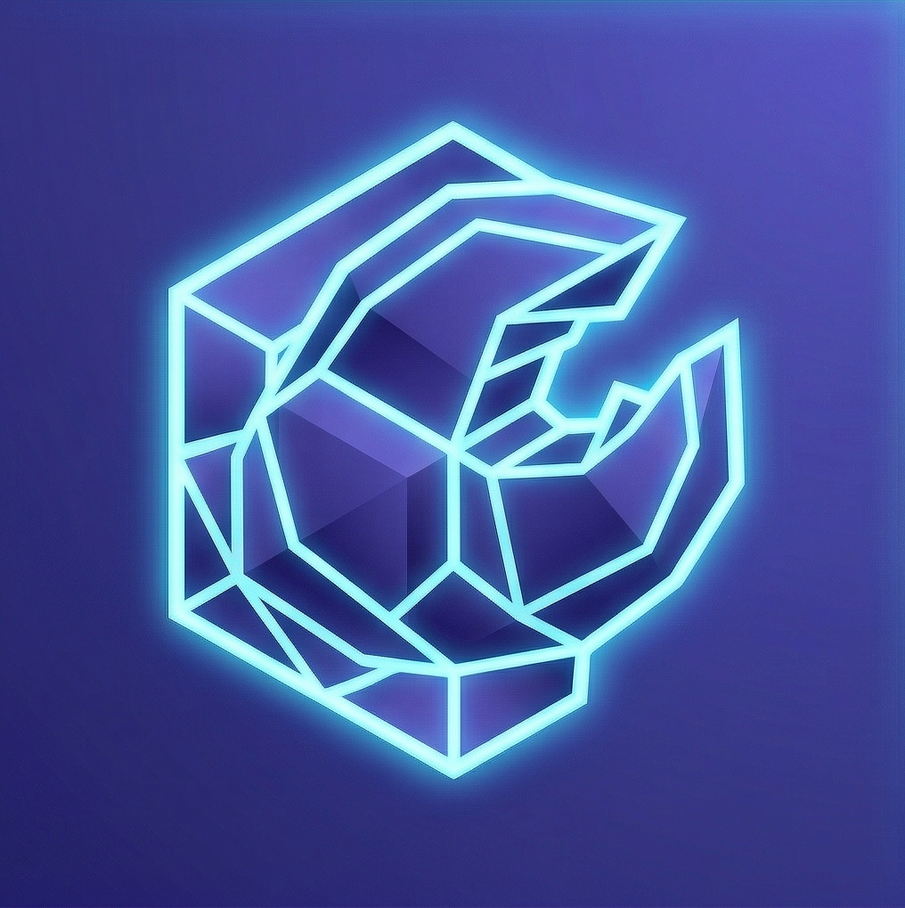

<p align="center">
  
</p>

<h1 align="center">🪝 HoloClaw</h1>

<p align="center">
  <strong>OpenClaw is single-player. HoloClaw is a team.</strong>
</p>

<p align="center">
  A <strong>multiplayer AI workspace agent</strong> for the <a href="https://hologram.zone">Hologram</a> + <a href="https://2060.io">2060.io</a> DIDComm stack.<br>
  Multiple verified users share one live LangChain session, each on their own encrypted channel,<br>
  with role-based tool access, runtime MCP curation, a live tool execution feed,<br>
  and human-in-the-loop approval gates.
</p>

<p align="center">
  <a href="#-testing"></a>
  <a href="https://nestjs.com"></a>
  <a href="https://www.typescriptlang.org"></a>
  <a href="https://js.langchain.com"></a>
  <a href="https://github.com/modelcontextprotocol/sdk"></a>
  <a href="https://identity.foundation/didcomm-messaging/spec/"></a>
  <a href="https://docs.docker.com/compose/"></a>
  <a href="https://postgresql.org"></a>
  <a href="https://redis.io"></a>
  <a href="./src/workspace/workspace-mcp.service.ts"></a>
  <a href="https://nodejs.org"></a>
  <a href="https://github.com/2060-io/hologram-generic-ai-agent-vs"></a>
  <a href="https://hologram.zone"></a>
</p>

---

## 🎬 The 30-second demo

1. **Scan the QR** on the landing page with the [Hologram iOS/Android app](https://hologram.zone) → a new DIDComm channel opens to the bot.
2. **You land in the `LOBBY`** state ([`state-step.enum.ts`](./src/core/common/enums/state-step.enum.ts)) and get a welcome message + two buttons: *Create workspace* / *Join with invite*.
3. **Tap "Create workspace"** → name it → send a goal → a `WorkspaceEntity` is persisted, you become the owner, and you're in `CHAT` with shared workspace memory.
4. **Tap "Add MCP server"** → paste `https://your-mcp-host/mcp` + `Bearer <token>` → [`WorkspaceMcpService.add()`](./src/workspace/workspace-mcp.service.ts) encrypts the header with AES-256-GCM, registers the server at runtime via [`McpService.addServer()`](./src/mcp/mcp.service.ts), discovers tools, and confirms `(N tools discovered)`.
5. **Tap "Invite a member"** → `InviteService` generates a single-use token → share it out-of-band with a teammate.
6. **Teammate scans the bot QR, pastes the token** → [`InviteService.redeem()`](./src/workspace/invite.service.ts) validates, creates a `WorkspaceMemberEntity`, and [`BroadcastService.broadcastText()`](./src/broadcast/broadcast.service.ts) fan-outs `👋 [alice] joined as collaborator.` to every online member.
7. **Ask the agent anything.** Both members see `🔧 [alice] calling github/search_code…` → `✅ [alice] github/search_code complete (820ms)` live in their threads, broadcast by the [`LiveFeedCallbackHandler`](./src/broadcast/live-feed-callback.handler.ts) installed on the LangChain `AgentExecutor`. If a tool requires approval, the approver gets a menu badge and taps to decide.

**That's a 30-second flow that's impossible to replicate in ChatGPT, Claude, or OpenClaw.** DIDComm is point-to-point by design, so multiplayer happens in the fan-out layer — that's the architectural heart of HoloClaw.

---

## ✨ What makes HoloClaw different

### Novel in the Hologram / DIDComm ecosystem

| Feature | Where it lives | Why it matters |
|---|---|---|
| **Shared workspace memory** keyed by `workspaceId`, not `connectionId` | [`src/llm/llm.service.ts`](./src/llm/llm.service.ts) | All members read/write the same LangChain memory. One cognitive context, many speakers. |
| **Speaker-tag disambiguation** over shared memory | [`src/chatbot/chatbot.service.ts`](./src/chatbot/chatbot.service.ts) | `[alice:collaborator]: <msg>` is prepended so the LLM knows who spoke. Format is configurable. |
| **Single tool choke point** — `ToolCallInterceptor` | [`src/rbac/tool-call-interceptor.service.ts`](./src/rbac/tool-call-interceptor.service.ts) | RBAC / approval / audit / broadcast all funnel through one method. No tool escapes the gate. |
| **Runtime MCP server registration with rollback** | [`src/workspace/workspace-mcp.service.ts`](./src/workspace/workspace-mcp.service.ts) | Admins paste URL + token in chat, get tools in seconds. Rollback on connect failure prevents zombie rows. |
| **Workspace-slug collision avoidance** (`ws-<8chars>-<name>`) | [`src/workspace/workspace-mcp.service.ts`](./src/workspace/workspace-mcp.service.ts) | Two workspaces can register servers named "github" without colliding in the global MCP tool list. |
| **AES-256-GCM encryption at rest** for BYOMCP headers | [`src/workspace/workspace-mcp.service.ts`](./src/workspace/workspace-mcp.service.ts) | Same primitive as the base agent's `McpConfigService` — one key, one algorithm, no duplication. |
| **Fan-out `BroadcastService`** with bounded concurrency | [`src/broadcast/broadcast.service.ts`](./src/broadcast/broadcast.service.ts) | Best-effort per-member delivery; one failure doesn't block the rest. Used for joins, tool events, approvals. |
| **Live-feed LangChain `BaseCallbackHandler`** | [`src/broadcast/live-feed-callback.handler.ts`](./src/broadcast/live-feed-callback.handler.ts) | `onToolStart`/`onToolEnd`/`onToolError` broadcast with three verbosity levels. Shared AI in real time. |
| **Invite tokens**: single-use or multi-use, TTL, revocable, role-granting | [`src/workspace/invite.service.ts`](./src/workspace/invite.service.ts) | Join a workspace in 30 seconds without a credential wallet dance. |
| **Observer guard** with friendly read-only refusal | [`src/core/core.service.ts`](./src/core/core.service.ts) (`handleStateInput` CHAT branch) | Observers see everything but their input is intercepted before the LLM, with a polite message — not silent drops. |

### Design decisions (see [`docs/HOLOCLAW_ARCHITECTURE.md`](./docs/HOLOCLAW_ARCHITECTURE.md) for the full ADRs)

| # | Decision | One-liner |
|---|---|---|
| **ADR-01** | Invite tokens for MVP; workspace credentials as V2 opt-in | Tokens are cheap and viral; credentials add a wallet detour that kills the demo. |
| **ADR-02** | Hybrid role source: invite-granted primary, credential `rolesAttribute` UNIONed | MVP teams run without credential infra; teams with issuance get automatic role promotion on top. |
| **ADR-03** | Fully shared memory per workspace | The "we're in this together" punchline only works if every member sees the same AI context. |
| **ADR-04** | BYOK deferred to V2 | Per-workspace LLM keys are a 3–5 day refactor; MVP ships a shared key with per-workspace rate limiting. |
| **ADR-05** | Observers are silent read-only receivers | Read-only with friendly refusal is less confusing than silent drops. |
| **ADR-06** | Multi-tenant from day one | Single-workspace is a degenerate case; the marginal cost is mostly `WHERE workspaceId = ?`. |

---

## 🏗 Architecture

```
                    ┌──────────────────────────┐
                    │      Hologram app        │   (iPhone / Android wallet)
                    └────────────┬─────────────┘
                                 │ DIDComm v2 (point-to-point, E2E)
                    ┌────────────▼─────────────┐
                    │   vs-agent :3001         │   @2060.io/vs-agent-nestjs-client 1.5.5
                    └────────────┬─────────────┘
                                 │ webhook (EVENTS_BASE_URL)
                    ┌────────────▼─────────────┐
                    │    HoloClaw (NestJS 11)  │
                    │  ┌───────────────────┐   │
                    │  │   CoreService     │   │  ← extended state machine
                    │  │   LOBBY → CHAT    │   │     8 states incl. workspace flows
                    │  └────┬─────────┬────┘   │
                    │       ▼         ▼        │
                    │   🪝 Workspace  🪝 Broad-│  ← HoloClaw overlay
                    │     Service     cast +   │     (new code)
                    │     Member      LiveFeed │
                    │     Invite      Callback │
                    │     McpService  Handler  │
                    │                          │
                    │   ToolCallInterceptor    │  ← RBAC + approval
                    │           │              │     (inherited upstream)
                    │           ▼              │
                    │   LlmService (LangChain) │
                    │     + AgentExecutor      │
                    │           │              │
                    │           ▼              │
                    │   MemoryService          │  ← keyed by workspaceId
                    │   (Redis or in-memory)   │     (one-line HoloClaw change)
                    └──────────────────────────┘
                               │ fan-out (BroadcastService)
                               ▼
                   Other workspace members
                   (each on their own DIDComm channel)
```

### Directory tree

```
src/
  ├── 🪝 workspace/        NEW — entities, services, BYOMCP crypto, 50 tests
  │     ├── workspace.entity.ts            Workspace owner + name + goal
  │     ├── workspace-member.entity.ts     connectionId + role + lastSeenAt
  │     ├── workspace-invite.entity.ts     single/multi-use tokens + TTL
  │     ├── workspace-mcp-server.entity.ts AES-256-GCM encrypted headers
  │     ├── workspace.service.ts           CRUD + maxPerOwner enforcement
  │     ├── workspace-member.service.ts    add/rolesFor/onlineMembers
  │     ├── invite.service.ts              create/redeem/revoke
  │     └── workspace-mcp.service.ts       BYOMCP add/remove/restore
  │
  ├── 🪝 broadcast/        NEW — fan-out + live tool feed, 23 tests
  │     ├── broadcast.service.ts           bounded-concurrency fan-out
  │     └── live-feed-callback.handler.ts  LangChain BaseCallbackHandler
  │
  ├── core/                CoreService extended with workspace state flows,
  │                          new visibleWhen predicates, observer guard
  ├── chatbot/             Speaker-tag prepending for workspace mode
  ├── llm/                 Memory re-keyed to workspaceId + LiveFeed wired
  ├── mcp/                 + addServer() / removeServer() runtime API
  ├── rbac/                Unchanged — UserContext extended with workspaceId
  ├── rag/                 Unchanged — inherited from upstream
  ├── memory/              Unchanged — key-agnostic, fed workspaceId now
  ├── config/              agent-pack.loader extended with holoclaw.* section
  └── main.ts

agent-packs/
  └── 🪝 holoclaw/         NEW — HoloClaw-specific agent pack
        └── agent-pack.yaml  menu items, workspace limits, liveFeed, speakerTags

docs/
  ├── 🪝 HOLOCLAW_ARCHITECTURE.md  Full 6-ADR spec, data model, component inventory
  ├── agent-pack-schema.md          (upstream)
  ├── rbac-approval-spec.md         (upstream — implemented in the base agent)
  └── …
```

🪝 = new in HoloClaw. Everything else is inherited from [`hologram-generic-ai-agent-vs`](https://github.com/2060-io/hologram-generic-ai-agent-vs) and continues to work unchanged.

---

## 🧱 Stack

| Layer | Technology | Version | Notes |
|---|---|---|---|
| Runtime | Node.js | `23-alpine` | Multi-stage Dockerfile |
| Framework | [NestJS](https://nestjs.com) | `^11.0.1` | Modular, DI-first |
| Language | TypeScript | `^5.7.3` | `strict` mode |
| LLM orchestration | [LangChain](https://js.langchain.com) | `^0.3.26` | AgentExecutor + DynamicStructuredTool |
| LLM providers | OpenAI / Anthropic / Ollama | `^4.100.0` / `^0.51.0` / `^0.2.1` | Swap via `LLM_PROVIDER` env |
| Tool protocol | [`@modelcontextprotocol/sdk`](https://github.com/modelcontextprotocol/sdk) | `^1.29.0` | stdio + SSE + streamable-http |
| Messaging | [`@2060.io/vs-agent-nestjs-client`](https://github.com/2060-io/vs-agent) | `1.5.5` | DIDComm v2 + VC auth + menus |
| Credentials | [`@credo-ts/core`](https://github.com/openwallet-foundation/credo-ts) | `^0.5.18` | Verifiable credential verification |
| RAG | Pinecone / Redis vector store | `^6.0.0` / `^0.1.0` | Optional; off by default |
| Database | PostgreSQL | `16-alpine` | via [TypeORM](https://typeorm.io) `^0.3.24` |
| Memory / cache | Redis | `7.4.0` | Shared memory backend for workspaces |
| Reverse proxy | Traefik | `v3.6` | Path-based routing for multi-bot deploys |
| Crypto at rest | AES-256-GCM | Node.js `crypto` (built-in) | BYOMCP headers + per-user MCP credentials |
| Validation | [Zod](https://zod.dev) | `^3.25.51` | `agent-pack.yaml` schema |
| Tests | Jest + `@nestjs/testing` | `^29.7.0` / `^11.0.1` | 75 tests, 7 suites, ~40s |

---

## 🧪 Testing

HoloClaw ships with a deep test suite. Every new service has unit coverage with proper repository mocks, and the `CoreService` workspace flows have end-to-end integration tests that exercise the full state machine with real service instances (only the DB and VS Agent client mocked).

| Suite | Tests | Coverage |
|---|---:|---|
| [`workspace.service.spec.ts`](./src/workspace/workspace.service.spec.ts) | 17 | create, findById, listForIdentity, isOwner, `maxPerOwner`, duplicates, trimming, empty/long names |
| [`invite.service.spec.ts`](./src/workspace/invite.service.spec.ts) | 12 | single/multi-use, revoke, expiry, unknown/empty token, role validation, unique generation |
| [`workspace-member.service.spec.ts`](./src/workspace/workspace-member.service.spec.ts) | 9 | add, conflict, reconnect, `rolesFor`, `findByConnection`, `attachConnection` |
| [`workspace-mcp.service.spec.ts`](./src/workspace/workspace-mcp.service.spec.ts) | 12 | slug generation, happy-path add, encrypted round-trip, duplicate rejection, cross-workspace isolation, rollback on connect failure, restoration on module init |
| [`broadcast.service.spec.ts`](./src/broadcast/broadcast.service.spec.ts) | 15 | fan-out, exclude, concurrent failures, every verbosity level, enable/disable toggles, direct-list delivery |
| [`live-feed-callback.handler.spec.ts`](./src/broadcast/live-feed-callback.handler.spec.ts) | 8 | `mcp_*` name parsing, start→end duration, error propagation, state cleanup, debug arg JSON parsing |
| [`core.service.holoclaw.spec.ts`](./src/core/core.service.holoclaw.spec.ts) | 7 | `newConnection` → `LOBBY`, create flow end-to-end, join flow with broadcast + exclude-self, invalid token, **observer guard never calls LLM**, leave flow preserves membership |
| **Total** | **75** | **7 suites, ~40s wall-time** |

```bash
pnpm install
pnpm exec jest src/workspace src/broadcast src/core/core.service.holoclaw
# Test Suites: 7 passed, 7 total
# Tests:       75 passed, 75 total
```

---

## 🚀 Self-hosting in 5 minutes

### Option 1 — Home-server monorepo (recommended)

HoloClaw lives inside [`AirKyzzZ/hologram-demos-home`](https://github.com/AirKyzzZ/hologram-demos-home) — a Docker Compose + Traefik + Tailscale Funnel stack designed for a single NUC under your desk. This is what's running the public demo.

```bash
ssh your-server
git clone https://github.com/AirKyzzZ/hologram-demos-home ~/holo-stack
cd ~/holo-stack/deploy/home-server
./setup.sh                                       # clones all bot sources + configures Tailscale Funnel

cp .env.example .env
$EDITOR .env                                     # set POSTGRES_PASSWORD, HOLOCLAW_AGENT_WALLET_KEY, PUBLIC_BASE_URL

cp bots/holoclaw/.env.example bots/holoclaw/.env
$EDITOR bots/holoclaw/.env                       # set OPENAI_API_KEY + MCP_CONFIG_ENCRYPTION_KEY

make up
make logs                                        # watch it come up
```

Your bot is now live at `https://<your-tailnet>.ts.net/holoclaw`. Scan the QR from the Hologram app and you're in.

The auto-update systemd timer pulls this repo + the holoclaw source every 15 minutes and rebuilds the image if HEAD changed — zero-effort CD.

### Option 2 — Standalone `docker-compose`

If you don't want the full multi-bot stack, you can run HoloClaw alone. Copy the `holoclaw-vsa` + `holoclaw-bot` service blocks from [`hologram-demos-home/deploy/home-server/docker-compose.yml`](https://github.com/AirKyzzZ/hologram-demos-home/blob/main/deploy/home-server/docker-compose.yml) plus the shared `postgres` + `redis` services, and you're good.

### Option 3 — Local dev

```bash
git clone https://github.com/AirKyzzZ/hologram-holoclaw-bot-vs
cd hologram-holoclaw-bot-vs
pnpm install
cp config.env .env
$EDITOR .env                                     # at minimum: OPENAI_API_KEY, MCP_CONFIG_ENCRYPTION_KEY
pnpm run start:dev
```

You'll need a running vs-agent sidecar for DIDComm — see the [upstream README](https://github.com/2060-io/hologram-generic-ai-agent-vs) for the docker-compose dev stack.

### Required secrets

| Variable | How to generate | Why |
|---|---|---|
| `OPENAI_API_KEY` | Your OpenAI account | LLM backend (or Anthropic / Ollama — see `LLM_PROVIDER`) |
| `MCP_CONFIG_ENCRYPTION_KEY` | `openssl rand -hex 32` | **Required for BYOMCP.** Encrypts workspace MCP server headers at rest. If this rotates, every stored BYOMCP server must be re-added. |
| `HOLOCLAW_AGENT_WALLET_KEY` | `openssl rand -base64 32` | Credo wallet encryption key for the vs-agent sidecar. **Never change** once the bot is running or every previously issued invitation is invalidated. |

---

## ⚙️ Configuration

All HoloClaw behaviour is declarative in [`agent-packs/holoclaw/agent-pack.yaml`](./agent-packs/holoclaw/agent-pack.yaml). Every knob is also exposed as an environment variable override.

```yaml
holoclaw:
  workspaces:
    multiTenant: true           # one deployment, many workspaces
    maxPerOwner: 10             # rate-limit workspace creation per identity
    nameMaxLength: 120
  invites:
    tokenTTLHours: 168          # 7 days
    defaultRole: collaborator
    allowedRoles: [collaborator, observer, approver]
  llmBudget:
    perWorkspaceTurnLimitPerHour: 60   # cost guardrail for shared-key MVP
    rejectOnExceed: true
  liveFeed:
    enabled: true
    verbosity: verbose           # minimal | verbose | debug
    broadcastToolErrors: true
  speakerTags:
    enabled: true
    format: '[{identity}:{role}]: '   # {identity} and {role} are substituted
  audit:
    retentionDays: 90
```

Every value above can be overridden at runtime via env vars prefixed with `HOLOCLAW_` (see [`src/config/app.config.ts`](./src/config/app.config.ts)).

---

## 🗺 Roadmap

| Version | Feature | Status |
|---|---|---|
| **V1.5** | Template workspaces (research / code / devops / content presets) | Planned — just new `agent-pack.yaml` files |
| **V1.5** | Tool execution audit viewer (queryable by workspace) | Planned — rows are already persisted |
| **V2** | **BYOK** — per-workspace LLM API keys | Table + migration shipped; service wiring deferred |
| **V2** | `WorkspaceMemberCredential` VC issuance for persistent rejoin | Spec'd in ADR-01 |
| **V2** | Media / file processing (PDFs, images, code attachments) | `MediaMessage` already received by the base agent |
| **V2** | Role-scoped memory digests (observers see summaries, collaborators see full stream) | Spec'd in ADR-03 |
| **V2** | Async task mode with BullMQ (agent works while everyone is offline) | Out of scope for MVP |

---

## 🤝 Credits

- Forked from [**`2060-io/hologram-generic-ai-agent-vs`**](https://github.com/2060-io/hologram-generic-ai-agent-vs) — inherits LLM, MCP, RAG, memory, RBAC, and the approval workflow. HoloClaw only adds the workspace overlay on top.
- Built on [**`@2060.io/vs-agent-nestjs-client`**](https://github.com/2060-io/vs-agent) `1.5.5` — the NestJS DIDComm client that makes Hologram bots possible.
- Runs inside the [**Hologram**](https://hologram.zone) mobile messaging platform — the DIDComm wallet that scans the QR codes.
- Trust registry powered by [**Verana**](https://github.com/verana-labs).
- Deployed as part of [**`AirKyzzZ/hologram-demos-home`**](https://github.com/AirKyzzZ/hologram-demos-home) — a personal lab for running verifiable-service agents on a home server behind Tailscale Funnel.
- Architecture spec, data model, and all six ADRs live in [`docs/HOLOCLAW_ARCHITECTURE.md`](./docs/HOLOCLAW_ARCHITECTURE.md). Read it if you want the why, not just the what.

---

## 📄 License

`UNLICENSED` — private during development, following the upstream convention. The base code lineage remains under the upstream [`2060-io/hologram-generic-ai-agent-vs`](https://github.com/2060-io/hologram-generic-ai-agent-vs) license.

---

<p align="center">
Made with 🪝 in Bordeaux by <a href="https://maximemansiet.fr">Maxime Mansiet</a><br>
<sub>DIDComm is point-to-point by design, so multiplayer happens in the fan-out layer. That's the architectural heart of HoloClaw.</sub>
</p>
